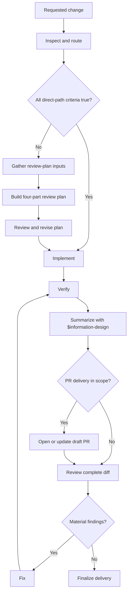

# Dev Task

Deliver the requested behavior at the lowest justified total cost. Prefer a local change. Widen scope only to protect correctness, ownership, or compatibility, or to materially reduce total complexity or risk.

## Workflow

## 1. Inspect and Route

Inspect enough repository context to choose a path from evidence.

Use the **direct path** only when every condition holds:

- outcome and invariants are unambiguous;
- owning subsystem and implementation pattern are clear;
- change is local and creates no material architecture, data, API, compatibility, security, or operational decision;
- validation is obvious;
- change is low-risk and readily reversible.

On the direct path, skip steps 2–4 and continue with implementation. Otherwise use the **reviewed path**.

Ask one focused question only when a missing choice would change behavior, compatibility, risk, or scope. Decide reversible details independently.

## 2. Gather Review-Plan Inputs

Collect the evidence needed to build and review the plan:

- observable outcome, invariants, scope, and explicit non-goals;
- current behavior or failure and its root cause;
- owning subsystem, integration boundaries, and likely future change surface;
- relevant code, tests, documentation, history, and conventions;
- existing concepts or utilities to reuse;
- compatibility, data, security, operational, rollout, and rollback constraints;
- risks, unresolved assumptions, and decisions requiring user input.

Treat required edits across unrelated modules as evidence that responsibility may be misplaced. Consult official or upstream documentation when external behavior affects the solution. Separate fact from inference when uncertainty could change the plan. Stop when remaining unknowns cannot change the solution or its proof.

## 3. Build the Review Plan

Start with a compact change contract: outcome, invariants, scope, and non-goals. Then write the following four sections with these exact headings.

### 1. Minimal Reasonable Solution

State the implementation steps and the smallest solution that satisfies the contract without sacrificing correctness, ownership, compatibility, or justified future change cost. Verify that it:

- fixes the root cause where the invariant is owned;
- keeps related behavior cohesive and future changes local;
- reuses existing concepts instead of creating parallel representations;
- adds an abstraction only when it removes more complexity than it creates;
- keeps blast radius and operational risk proportional to demonstrated value.

Prefer the smaller coherent solution. Widen the diff only for correctness, ownership, compatibility, or a material reduction in total complexity or risk.

### 2. Matrix Decisions on Complications

Record every complication that creates a material fork:

| Complication | Options | Decision | Rationale and Cost |
| --- | --- | --- | --- |
| ... | ... | ... | ... |

Use exactly these four columns; do not combine or omit them. List viable options before choosing. Exclude reversible implementation details. If no material fork exists, write `Not applicable — no consequential complication`.

### 3. Refactoring Options

Record task-related refactoring options:

| Option | Value | Cost and Risk | Decision |
| --- | --- | --- | --- |
| ... | ... | ... | Include / Defer / Reject |

Use exactly these four columns; keep value, cost, and decision separate. Include a refactor only when required for correctness or ownership, or when it materially reduces task complexity, duplication, coupling, risk, or future blast radius. Defer adjacent cleanup. If no meaningful option exists, write `Not applicable — no task-related refactor`.

### 4. Test Coverage Plan

Map every invariant, material decision, and risk to evidence:

| Behavior or Risk | Test or Check | Level |
| --- | --- | --- |
| ... | ... | Unit / Integration / E2E / Static / Runtime |

Cover changed behavior, regression risk, boundaries, side effects, failure paths, required static checks, and rollout or rollback when state or compatibility changes. Prefer semantic assertions against stable outcomes. Assert exact wording only when it is an explicit contract.

All four sections are mandatory. Only sections 2 and 3 may use `Not applicable`, with a concrete reason.

Keep the four headings in the active plan. Create `<repo-root>/.dev-tasks/<name>.md` only when the work is decision-heavy, crosses subsystems, has dependent stages, or needs handoff. Before creating anything under `.dev-tasks`, ensure the target repository's `.gitignore` contains the idempotent entry `.dev-tasks/`; create `.gitignore` if it does not exist, and preserve all existing entries. Add an empty deviation log and record only material changes to scope or decisions.

## 4. Review and Revise the Plan

Review each section separately, then check that they agree:

- the solution satisfies the change contract and fixes the owning boundary;
- the matrix exposes material complications, viable options, and explicit decisions;
- refactor decisions match the chosen scope and solution;
- the test plan covers every invariant, decision, failure path, and material risk.

Reject a plan with a missing section, collapsed matrix fields, unsupported `Not applicable`, unresolved consequential decision, or uncovered risk. Use an independent reviewer when breadth or risk justifies the coordination cost. Revise until the plan passes; do not code before it does.

## 5. Implement

Follow repository patterns and the approved plan. Keep unrelated changes out of the diff. For a bug, add a regression test that fails on the original defect when practical. Follow test-first development when the user or repository requires it.

If implementation invalidates the plan, stop and revise the affected plan sections. Record any material deviation before continuing.

## 6. Verify

Run the planned targeted checks first, then the broader relevant suite. Read the output and fix failures. Prove the observable outcome and every invariant with fresh evidence.

Inspect the task diff and working tree for missing, unrelated, or accidental changes. Neither a commit nor an open PR proves completion.

## 7. Summarize with Information Design

After verification, use `$information-design` to build the implementation summary from the actual diff and evidence, not from the original plan. Lead with the outcome, then include only what helps the reader assess the change:

- a concise **System context** section before the change details: explain how the affected part currently works and is structured, including its responsibility, relevant components or boundaries, important control or data flow, and where the change fits; include only the context needed to understand the change and its impact, using one or two sentences for a simple local edit;
- what changed, where, and why;
- exact validation commands and results;
- diff cost: size and what justified it;
- consequential decisions and deviations;
- remaining risks and deferred work.

Keep direct-change summaries compact. Separate verified fact from reviewer judgment. Omit empty sections and process narration. Use this summary as the basis for the PR description and final report.

## 8. Deliver and Review

When PR delivery is in scope and a remote is available:

1. open or update the draft PR with the implementation summary;
2. review the complete PR diff for correctness, scope, tests, security, compatibility, unnecessary complexity, and accidental edits;
3. fix material findings and rerun affected checks;
4. regenerate the summary with `$information-design` when the diff or evidence changes;
5. update the PR description and readiness state.

For local-only work, perform the same diff review and deliver the summary without opening a PR. Finalize only when no material finding remains and the summary matches the verified diff. Add the PR link and status to the final report when applicable.
