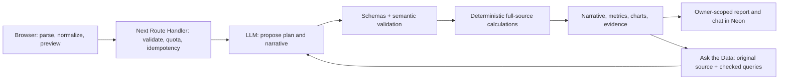

# DataTale

Turn a CSV, Excel workbook, or short report into a grounded narrative, interactive charts, and source-backed answers.

[Live product](https://datatale.bizhov.ru) · [Reproducible demo](docs/DEMO.md) · [3–5 minute pitch script](docs/PITCH.md) · [Delivery evidence](docs/DELIVERY.md)


_The screenshot uses DataTale's deterministic synthetic onboarding report. The linked CSV reproduces the same totals through the real import and AI-analysis flow without exposing private data._

## Reviewer quick path

1. Open the [live product](https://datatale.bizhov.ru) with no account or login.
2. Upload [docs/demo-data.csv](docs/demo-data.csv), inspect the 12-row preview, and optionally provide the focus from [DEMO.md](docs/DEMO.md).
3. Review the 2–3 sentence hero, deterministic metrics, AI-selected charts, formulas, and evidence coverage.
4. Ask one answerable question and one question about missing data. The latter must return `В этом отчете нет такой информации`.
5. Reopen the saved report without another AI request, or delete the guest workspace through the confirmed destructive flow.

## Why the result is grounded

- **The model proposes; code decides.** The LLM may select metrics and bar, line, or donut charts from a bounded catalog. Zod and semantic validators reject unsupported fields, incomplete totals, invalid time axes, and ungrounded output.
- **Application code calculates every displayed value.** Metrics and chart points are derived from the complete accepted table. The narrative may reference only checked fact and evidence IDs.
- **Chat reads the immutable original source.** For tables, the model proposes a bounded query that code validates and executes over every accepted row; for text, it reads every bounded source chunk. Typed evidence and checked arithmetic support lookups, comparisons, totals, shares, and changes without trusting model calculations.
- **Failures stay explicit.** Input limits, corrupt workbooks, model timeouts, invalid model output, quota exhaustion, expired sessions, and persistence failures have separate actionable states.



## Product behavior

DataTale supports local CSV/XLSX parsing, workbook sheet selection, pasted text, bounded previews, cancellation, responsive loading, light/dark/system themes, expanded charts, evidence drill-down, recommendations, and grounded chat. Pasted text produces exact-quotation observations and code-calculated bar or line charts when compatible quantities support them; qualitative or incompatible text receives an honest no-chart explanation. A skippable first-visit tour uses a deterministic local demo and spends no model request.

Analysis creates a sealed guest workspace. The accepted canonical source, validated report, and chat are stored for seven days; original binary uploads are not stored. History is owner-scoped and reopens a report without consuming analysis or chat quota. Losing the sealed cookie ends access, while confirmed delete-all removes the workspace data and clears the client state.

Each guest workspace receives five analyses and five user chat messages per UTC day across all of its reports. Today's access code raises both workspace limits to 20; usage before unlock remains part of those totals, while another workspace using the same code receives its own allowance. The server derives the rotating code from one secret seed and stores only a sealed daily capability. Salted-IP and global analysis ceilings remain secondary abuse controls. Raw access codes, secret seeds, and IP addresses are never persisted.

## Stack and quality gates

- Next.js 16 App Router, React 19, TypeScript, Bun, Biome, and Steiger
- HeroUI v3, Motion, Recharts, `react-dropzone`, Papa Parse, and `read-excel-file`
- Vercel Functions, Neon/PostgreSQL through the Neon serverless driver, Drizzle schema tooling, and `iron-session`
- Vercel AI SDK with an OpenAI-compatible gateway and strict provider schemas
- Vitest plus Playwright/axe across desktop Chromium, mobile Chromium, and mobile WebKit

The current release status, exact test counts, review corrections, and production evidence live in [docs/DELIVERY.md](docs/DELIVERY.md). Deterministic CSV, multi-sheet XLSX, pasted-text, malformed-file, and unsupported-format acceptance fixtures with expected answers live in [tests/manual/README.md](tests/manual/README.md).

## Local development

### Prerequisites

- Git
- Node.js 24.12.0, pinned in `.nvmrc`
- Bun 1.3.14, pinned in `package.json`
- Network access to Neon and the configured AI gateway for the full application

With [nvm](https://github.com/nvm-sh/nvm), `nvm install && nvm use` selects the expected Node.js version. Install Bun from its [official instructions](https://bun.sh/docs/installation), then confirm `bun --version` prints `1.3.14`.

### Install

```bash
git clone https://github.com/bizhello/datatale.git
cd datatale
nvm install
nvm use
bun install --frozen-lockfile
```

This repository uses Bun only. Do not create npm, Yarn, or pnpm lockfiles.

### UI-only mode

```bash
bun run dev
```

Open `http://localhost:3000`. Without secrets, the landing page, onboarding, deterministic demo, local CSV/XLSX/text parsing, sheet selection, and preview work. Real AI analysis, saved history, access-code unlock, and grounded chat require the full server configuration below. Those server boundaries fail closed when configuration is incomplete.

### Full local mode

1. Copy the tracked template into the ignored local environment file:

   ```bash
   cp .env.example .env.local
   ```

2. Generate independent random secrets and paste the output into the corresponding empty values in `.env.local`:

   ```bash
   bun -e 'const {randomBytes}=require("node:crypto"); for (const name of ["SESSION_PASSWORD","RATE_LIMIT_SALT","CRON_SECRET","ANALYSIS_INVITE_CODE_SEED"]) console.log(`${name}=${randomBytes(32).toString("base64url")}`)'
   ```

3. Create a separate development project or branch in [Neon](https://console.neon.tech). Copy its pooled connection string into `DATABASE_URL`. Do not use the production database for local development. The application runtime uses Neon's HTTP driver; a plain local Docker PostgreSQL instance is useful for isolated migration probes but is not the supported full-app runtime.

4. Set the AI gateway values. The checked-in defaults target the project-provided OpenAI-compatible Spiro gateway; `OPENAI_API_KEY` must be a valid key for that gateway. A ChatGPT subscription is not an API credential and cannot be placed here.

5. Apply the canonical ordered SQL migrations, then start the application:

   ```bash
   bun run db:migrate
   bun run dev
   ```

   A new database applies migrations `0001` through `0006`. Running the command again should report `Applied 0 migrations.` Local `dev` and ordinary local `build` commands never migrate automatically. Do not use `drizzle-kit push`; the reviewed SQL ledger under `migrations/` is authoritative.

The local environment variables are:

| Variable | Purpose | Required for full mode |
| --- | --- | --- |
| `DATABASE_URL` | Neon PostgreSQL connection used by storage and migrations | Yes |
| `OPENAI_BASE_URL` | OpenAI-compatible gateway URL | Yes |
| `OPENAI_API_KEY` | Gateway API credential | Yes |
| `AI_MODEL` | Gateway model identifier | Yes |
| `SESSION_PASSWORD` | Seals guest workspace cookies; use at least 32 random characters | Yes |
| `RATE_LIMIT_SALT` | Salts non-reversible abuse-control fingerprints | Yes |
| `ANALYSIS_IP_DAILY_LIMIT` | Secondary daily free-analysis ceiling per salted IP | Yes; positive integer |
| `ANALYSIS_GLOBAL_DAILY_LIMIT` | Daily analysis ceiling across the deployment | Yes; positive integer |
| `ANALYSIS_INVITE_CODE_SEED` | Derives the rotating daily access code; unpadded base64url for at least 32 random bytes | Required for unlock only |
| `CRON_SECRET` | Authorizes the scheduled retention cleanup endpoint | Required for cleanup only |

Keep every value server-only: never prefix it with `NEXT_PUBLIC_`, commit `.env.local`, print it in logs, or expose it to browser code. Restart `bun run dev` after changing environment variables.

### Daily access code

With `ANALYSIS_INVITE_CODE_SEED` present in `.env.local`, derive today's code locally:

```bash
bun run access:code
```

The command prints the code and its UTC expiry. It reads local environment values only; it does not fetch Vercel configuration or rotate the seed. Production and local environments derive the same daily code only when they use the same seed.

### Commands

| Command | Purpose |
| --- | --- |
| `bun run dev` | Start the Next.js development server |
| `bun run build` | Create an ordinary production build without migrations |
| `bun run start` | Serve an existing production build |
| `bun run lint` | Run Biome checks and fail on warnings |
| `bun run format` | Format owned files with Biome |
| `bun run architecture` | Check FSD boundaries with Steiger |
| `bun run typecheck` | Generate Next.js route types and run strict TypeScript |
| `bun run test` | Run the Vitest suite once |
| `bun run test:watch` | Run Vitest in watch mode |
| `bun run test:e2e` | Run the Playwright browser matrix |
| `bun run db:migrate` | Apply pending ordered SQL migrations to `DATABASE_URL` |
| `bun run access:code` | Derive today's access code from the local seed |
| `bun run check` | Run Biome, Steiger, typecheck, Vitest, and the production build |
| `bun run check:all` | Run `check` followed by Playwright |
| `bun run build:vercel` | Deployment wrapper; migrates only a production `main` build, then builds Next.js |

Use `bun run test`, not Bun's separate `bun test` runner; the project suite is configured through the package script.

### Browser tests

Install the pinned browser binaries once:

```bash
bunx --no-install playwright install chromium webkit
bun run test:e2e
```

On Linux CI images that lack browser system packages, use `bunx --no-install playwright install --with-deps chromium webkit`. Browser tests start an isolated production server on port 3200. The complete local release gate is `bun run check:all`.

### Troubleshooting

| Symptom | Resolution |
| --- | --- |
| `bun: command not found` or the wrong Bun version | Install Bun, reopen the shell, and confirm `bun --version` is `1.3.14` |
| Node engine or native dependency errors | Run `nvm install && nvm use`, then `bun install --frozen-lockfile` |
| Port 3000 is occupied | Start on another port with `bun run dev -- -p 3001` |
| `Database migration failed.` | Confirm `.env.local` contains a reachable Neon `DATABASE_URL`; the runner intentionally hides credentials and detailed connection output |
| Analysis/history/chat returns HTTP 503 | Complete the required environment values, apply all migrations, and restart the dev server |
| `bun run access:code` rejects the seed | Generate a new 32-byte base64url seed with the command above and copy it exactly, without quotes or padding changes |
| Playwright reports a missing executable | Run the browser installation command above; on Linux, add `--with-deps` |
| New environment values appear ignored | Stop and restart `bun run dev`; environment files are loaded when the server starts |

Production deployment, migration guards, retention, and smoke checks are documented in [docs/DEPLOYMENT.md](docs/DEPLOYMENT.md).

## Documentation map

| Question | Canonical document |
| --- | --- |
| What must the product do? | [Product and acceptance criteria](docs/PRODUCT.md) |
| Which technologies are selected? | [Technology decisions](docs/DECISIONS.md) |
| Where does behavior belong? | [Architecture](docs/ARCHITECTURE.md) |
| How does AI choose charts and justify claims? | [AI contracts](docs/AI.md) |
| What should it look and feel like? | [UI contract](docs/UI.md) |
| What must pass before a change ships? | [Quality gates](docs/QUALITY.md) |
| What is deployed? | [Delivery board](docs/DELIVERY.md) |
| How can the checked submission flow be reproduced? | [Demo guide](docs/DEMO.md) |
| How do multiple agents collaborate? | [Workflow](docs/WORKFLOW.md) |
| How is production operated? | [Deployment](docs/DEPLOYMENT.md) |
| Which project-local agent skills are installed? | [Skills and provenance](docs/SKILLS.md) |
| What actually happened while using AI? | [AI worklog](docs/AI-WORKLOG.md) |
| How should the pitch be recorded? | [Pitch script](docs/PITCH.md) |

Engineering documentation, prompts, comments, tests, commits, PRs, and review comments use English. The product UI remains Russian by design.
