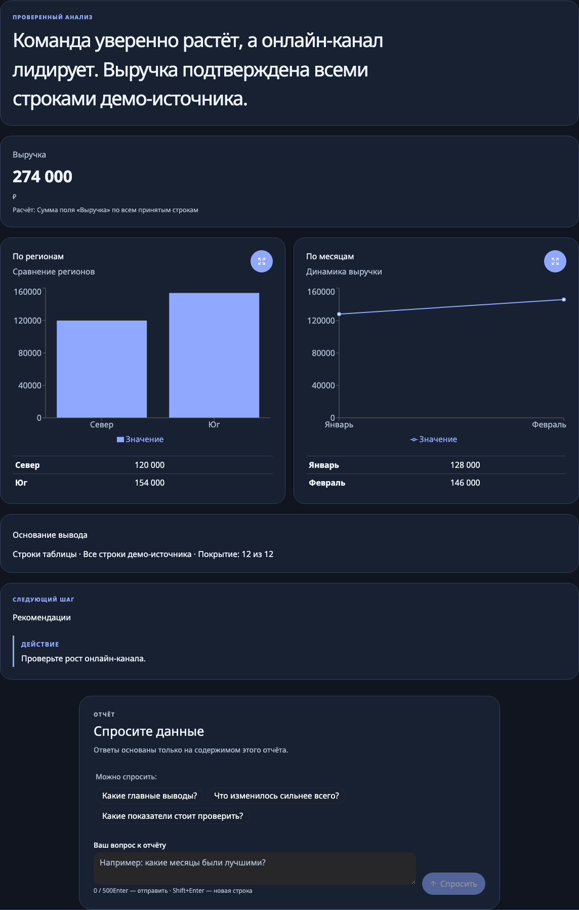
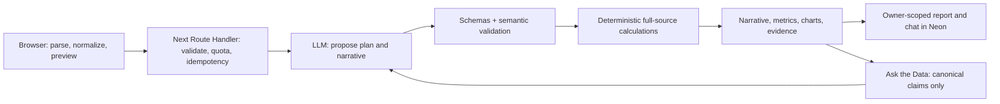

# DataTale

Turn a CSV, Excel workbook, or short report into a grounded narrative, interactive charts, and source-backed answers.

[Live product](https://datatale.bizhov.ru) · [Reproducible demo](docs/DEMO.md) · [3–5 minute pitch script](docs/PITCH.md) · [Delivery evidence](docs/DELIVERY.md)



_The screenshot uses DataTale's deterministic synthetic onboarding report. The linked CSV reproduces the same totals through the real import and AI-analysis flow without exposing private data._

## Reviewer quick path

1. Open the [live product](https://datatale.bizhov.ru) with no account or login.
2. Upload [docs/demo-data.csv](docs/demo-data.csv), inspect the 12-row preview, and optionally provide the focus from [DEMO.md](docs/DEMO.md).
3. Review the 2–3 sentence hero, deterministic metrics, AI-selected charts, formulas, and evidence coverage.
4. Ask one answerable question and one question about missing data. The latter must return `В этом отчете нет такой информации`.
5. Reopen the saved report without another AI request, or delete the guest workspace through the confirmed destructive flow.

## Why the result is grounded

- **The model proposes; code decides.** The LLM may select metrics and bar, line, or donut charts from a bounded catalog. Zod and semantic validators reject unsupported fields, incomplete totals, invalid time axes, and ungrounded output.
- **Application code calculates every displayed value.** Metrics and chart points are derived from the complete accepted table. The narrative may reference only checked fact and evidence IDs.
- **Chat reads immutable server-owned context.** Ask the Data answers from canonical source/report claims, persists validated results for replay, and returns an exact refusal when the source lacks the requested information.
- **Failures stay explicit.** Input limits, corrupt workbooks, model timeouts, invalid model output, quota exhaustion, expired sessions, and persistence failures have separate actionable states.



## Product behavior

DataTale supports local CSV/XLSX parsing, workbook sheet selection, pasted text, bounded previews, cancellation, responsive loading, light/dark/system themes, expanded charts, evidence drill-down, recommendations, and grounded chat. Pasted text produces quotation-backed facts and an explicit no-chart explanation; chart planning is limited to suitable tables. A skippable first-visit tour uses a deterministic local demo and spends no model request.

Analysis creates a sealed guest workspace. The accepted canonical source, validated report, and chat are stored for seven days; original binary uploads are not stored. History is owner-scoped and reopens a report without consuming analysis or chat quota. Losing the sealed cookie ends access, while confirmed delete-all removes the workspace data and clears the client state.

Guests receive one analysis per workspace per UTC day. A broader salted-IP ceiling allows separate visitors behind shared NAT to complete a first run while limiting repeated cookie resets. The exact built-in synthetic demo uses a separate IP namespace; workspace and global limits still apply. A high-entropy invite code can unlock a separate ten-analysis daily budget; only SHA-256 code fingerprints are configured or persisted. Raw invite codes and IP addresses are never stored.

## Stack and quality gates

- Next.js 16 App Router, React 19, TypeScript, Bun, Biome, and Steiger
- HeroUI v3, Motion, Recharts, `react-dropzone`, Papa Parse, and `read-excel-file`
- Vercel Functions, Neon/PostgreSQL, Drizzle ORM, and `iron-session`
- Vercel AI SDK with an OpenAI-compatible gateway and strict provider schemas
- Vitest plus Playwright/axe across desktop Chromium, mobile Chromium, and mobile WebKit

The current release status, exact test counts, review corrections, and production evidence live in [docs/DELIVERY.md](docs/DELIVERY.md).

## Development

Node.js is pinned in `.nvmrc`; Bun is pinned by `packageManager` in `package.json`.

```bash
bun install --frozen-lockfile
bun run dev
```

Open `http://localhost:3000`. Local input, preview, and onboarding need no secrets. Analysis, history, and chat require the server-only values documented in `.env.example`. Apply the ordered Neon migration ledger locally with `bun run db:migrate`; guarded Vercel production builds migrate `main` before `next build`, while local builds never migrate.

```bash
bun run check                        # Biome, architecture, types, Vitest, build
bunx --no-install playwright install chromium webkit
bun run test:e2e                     # production browser matrix
bun run check:all                    # complete local release gate
```

Use `bun run test`, not Bun's separate `bun test` runner. Browser tests start an isolated production server on port 3200.

## Documentation map

| Question | Canonical document |
| --- | --- |
| What must the product do? | [Product and acceptance criteria](docs/PRODUCT.md) |
| Which technologies are selected? | [Technology decisions](docs/DECISIONS.md) |
| Where does behavior belong? | [Architecture](docs/ARCHITECTURE.md) |
| How does AI choose charts and justify claims? | [AI contracts](docs/AI.md) |
| What should it look and feel like? | [UI contract](docs/UI.md) |
| What must pass before a change ships? | [Quality gates](docs/QUALITY.md) |
| What is deployed? | [Delivery board](docs/DELIVERY.md) |
| How do multiple agents collaborate? | [Workflow](docs/WORKFLOW.md) |
| How is production operated? | [Deployment](docs/DEPLOYMENT.md) |
| What actually happened while using AI? | [AI worklog](docs/AI-WORKLOG.md) |
| How should the pitch be recorded? | [Pitch script](docs/PITCH.md) |

Engineering documentation, prompts, comments, tests, commits, PRs, and review comments use English. The product UI remains Russian by design.
