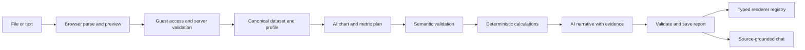

# Architecture

**Model:** one guest workspace owns immutable datasets, reports and messages. An analysis plan becomes checked facts; a report combines those facts with narrative and chart specifications. UI, model provider and persistence do not own arithmetic.

## Target structure

Lightweight FSD with Next.js App Router as the application layer.

```text
src/
  app/                          routing, composition, metadata, global theme tokens
  widgets/dashboard-shell/      screen composition and interaction coordination
  features/
    import-data/                picker, preview, parsing orchestration
    analyze-data/server/        prompt loading, constrained plan, verified report
    ask-data/                   chat UI and server orchestration
  entities/
    dataset/                    source schema, normalization and pure calculations
    report/                     report/plan contracts, chart capabilities and renderers
  shared/
    config/                     environment and product limits
    lib/                        small infrastructure utilities with a real consumer
    ui/                         genuinely reused visual patterns
```

Create additional slices with their first consumer. Guest workspace contracts belong in an entity when persistence is added. The client-only `features/onboarding` owns Driver.js lifecycle and the versioned UI preference; the dashboard widget supplies stable targets and coordinates demo display.

## Import and ownership rules

- Dependencies flow down: app → widgets → features → entities → shared. No cross-feature or cross-entity slice imports.
- Cross-entity validation happens in the consuming feature, which can import both public entity APIs. Report specs carry primitive field/fact references resolved there; do not move business schemas into shared to evade boundaries.
- External consumers use narrow public entry points; internal imports are relative. Separate `index.ts` for safe contracts/UI from `server.ts` for server-only exports. Never re-export private server dependencies through a mixed barrel.
- FSD public APIs are a boundary tool, not permission to create a global barrel importing every heavy component.
- Route Handlers validate access/body/limits, call a feature service, and map typed outcomes to HTTP. They contain no business calculations.
- UI components render validated models and dispatch actions; no SQL or model SDK calls inside them.
- Dataset calculations are pure functions; report model code contains no React. Chart renderer modules may import React/Recharts, but server prompts must import only the serializable capability catalog.
- Provider construction, DB client, cookie configuration and secret validation are server-only. Pass external dependencies at the operation boundary for testing; avoid a universal service container.

## State ownership

| State | Owner |
| --- | --- |
| Input selection, dialogs, local filters | React useState, lifted to the nearest shared parent when needed |
| Parse/analyze/cancel/retry transitions | Feature-owned useReducer with a discriminated state union |
| Saved report list/detail and mutations | TanStack Query with report/workspace-scoped keys |
| Active chat messages and streaming | AI SDK chat state; persist completed messages through the server boundary |
| Theme | next-themes |
| Tour completion/dismissal | Onboarding feature's versioned localStorage preference |
| Durable source, report and message records | Server-side storage |

Use one owner for each value. Do not mirror Query results in a global store or maintain two live copies of the chat transcript. Load persisted chat once when opening a report, then let the AI SDK own the active conversation; invalidate relevant saved-history queries after persistence. Clear private query/chat state when guest access ends or data is deleted.

Pass state through feature/widget composition before introducing context. Add narrowly scoped context only for a real shared subtree. Zustand is the preferred candidate if implementation demonstrates substantial cross-tree client state that these owners cannot handle cleanly; introduce it through a reviewed decision with a concrete consumer. The MVP does not currently require Zustand or Redux.

## Data flow and storage



| Record | Ownership and contents |
| --- | --- |
| GuestWorkspace | Random server ID, expiry/revocation; no account credentials |
| Dataset | Guest owner, immutable normalized source JSONB, schema, units, warnings, fingerprint, version, expiry |
| Report | Guest/dataset references, goal, state, blueprint, checked output, model/prompt/schema/catalog versions, run ID/deadline |
| Message | Report reference, role, text, evidence, status and date |

Keep small normalized inputs in bounded JSONB for MVP. Do not retain original binary files initially. A saved chart alone cannot support later chat: retain the accepted dataset until its retention deadline. Corrections produce a new dataset/report version rather than silently changing old evidence.

## Guest access

Use iron-session for sealed cookie payloads, not hand-written signing. Production: host-only `__Host-datatale`, HttpOnly, Secure, SameSite=Lax, Path=/, no Domain attribute. Store minimal workspace identity/expiry, not report data. Validate the unsealed shape and workspace activity on every operation; a client-supplied owner ID is never authority.

Use a server-only secret and explicit TTL settings matching PRODUCT. Dev HTTP cookie settings are separate. Protect mutations against CSRF; private responses are not publicly cached. Serialize first-session creation so concurrent initial requests do not orphan reports under competing cookies. Delete-all revokes access server-side. IP is a rate-limit signal, not ownership.

## Planned API surface

```text
POST/DELETE /api/guest
POST/GET    /api/reports
GET/DELETE  /api/reports/:id
POST        /api/reports/:id/chat
GET         /api/reports/:id/messages
```

Report detail returns status and saved output. Internal source lookup and references remain owner-checked. Reuse blueprint calls report creation with a permitted previous report reference; no separate template service initially.

## Failure and extension boundaries

Use explicit outcomes for invalid input, insufficient data, unsupported operation, invalid model output, rate limit, provider timeout, expired access and storage failure. A schema-valid response is not automatically a successful report.

States: idle → parsing → ready-to-analyze → analyzing → ready; failed/cancelled states retain a safe retry path. Use a discriminated union instead of independent booleans that allow contradictory combinations. Abort stale client requests and ignore late responses by request ID. Final save is atomic; do not label an unsaved result saved.

Use idempotency keys and a server-side run claim to prevent duplicate paid requests. Bound execution, attempts and output. A small MVP run may use one request; do not claim durable background execution after tab closure. Reopening checks state, not automatically reruns inference. Expired run leases expose an explicit retry.

Add a chart by extending capability metadata, schema and renderer mapping plus contract tests. Add a parser through import-data and canonical Dataset, leaving analysis unchanged. Swap a provider at the AI boundary after fixture evaluation. Change storage through entity repositories, not UI.
