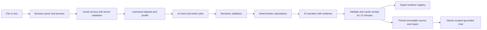

# Architecture

**Model:** a guest workspace owns analysis receipts and saved analyses. An AI analysis plan becomes checked facts; a report combines those facts with narrative and chart specifications. Application code owns arithmetic and semantic validation. Accepted source, validated report, and chat messages are persisted server-side for seven days from creation and remain owner-scoped and immutable.

## Target structure

Lightweight FSD with Next.js App Router as the application layer.

```text
src/
  app/                          routing, composition, metadata, global theme tokens
  widgets/dashboard-shell/      screen composition and interaction coordination
  features/
    import-data/                picker, preview, parsing orchestration
    analyze-data/               client lifecycle, prompt orchestration, calculations, verified report UI
    query-report/               grounded chat UI and server orchestration
    onboarding/                 first-visit tour lifecycle and preference
  entities/
    dataset/                    source schema, normalization and pure calculations
    report/                     report/plan contracts, chart capabilities and renderers
    guest-workspace/            sealed guest-session contract and repository
    saved-analysis/             persisted source/report/message repository
  shared/
    config/                     environment and product limits
    lib/                        small infrastructure utilities with a real consumer
    ui/                         genuinely reused visual patterns
```

Create additional slices with their first consumer. `entities/guest-workspace` owns the sealed guest-session contract and server repository. `features/onboarding` owns Driver.js lifecycle and the versioned local preference; the dashboard widget supplies stable targets and coordinates the deterministic demo.

## Import and ownership rules

- Reuse domain-neutral helpers through `shared/lib`, configuration through `shared/config`, and repeated visual patterns through `shared/ui`. Search existing owners before adding a helper. Extract only when consumers share behavior and invariants; keep domain-specific logic with its entity or feature.
- Dependencies flow down: app → widgets → features → entities → shared. No cross-feature or cross-entity slice imports.
- Cross-entity validation happens in the consuming feature, which can import both public entity APIs. Report specs carry primitive field/fact references resolved there; do not move business schemas into shared to evade boundaries.
- External consumers use narrow public entry points; internal imports are relative. Separate `index.ts` for safe contracts/UI from `server.ts` for server-only exports. Never re-export private server dependencies through a mixed barrel.
- FSD public APIs are a boundary tool, not permission to create a global barrel importing every heavy component.
- Route Handlers validate access/body/limits, call a feature service, and map typed outcomes to HTTP. They contain no business calculations.
- UI components render validated models and dispatch actions; no SQL or model SDK calls inside them.
- Dataset calculations are pure functions; report model code contains no React. Chart renderer modules may import React/Recharts, but server prompts must import only the serializable capability catalog.
- Provider construction, DB client, cookie configuration and secret validation are server-only. Pass external dependencies at the operation boundary for testing; avoid a universal service container.

## Component organization

Keep one React component per production TSX file. Component props may be declared beside the component; other named state/protocol types belong in the owning slice's type module. A screen component composes child components and consumes a feature hook; reducers and asynchronous lifecycle orchestration belong in `model`, and cohesive pure helpers in `lib`. Keep domain-specific demo data/configuration within the feature.

Use direct relative imports inside a slice and preserve its narrow public API. Do not add a global types or utilities bucket, a barrel for every directory, or one file for every trivial expression. Extract components around meaningful UI responsibilities (input, loading, error, preview), preserving React identity and existing behavior.

## State ownership

| State | Owner |
| --- | --- |
| Input selection, dialogs, local filters | React useState, lifted to the nearest shared parent when needed |
| Parse/analyze/cancel/retry transitions | Feature-owned useReducer with a discriminated state union |
| Current accepted source and rendered report | Dashboard/widget composition plus feature-owned hooks |
| Active chat messages and request lifecycle | `query-report` feature hook; persist completed results through the server boundary |
| Theme | next-themes |
| Tour completion/dismissal | Onboarding feature's versioned localStorage preference |
| Durable source, report and message records | Server-side storage |

Use one owner for each value. Do not maintain two live copies of the chat transcript. Clear private source/report/chat state when guest access ends or data is deleted. A future report-history UI may introduce TanStack Query only with its first real list/detail consumer.

Pass state through feature/widget composition before introducing context. Add narrowly scoped context only for a real shared subtree. Zustand is the preferred candidate if implementation demonstrates substantial cross-tree client state that these owners cannot handle cleanly; introduce it through a reviewed decision with a concrete consumer. The MVP does not currently require Zustand or Redux.

## Data flow and storage



| Record | Ownership and contents |
| --- | --- |
| GuestWorkspace | Implemented: random server ID, inactivity expiry/revocation; no account credentials |
| AnalysisRun | Implemented: workspace/key/fingerprint, lease/provider state, failure or validated report; 15-minute TTL |
| QuotaBucket | Implemented: UTC daily workspace, hashed-IP and global counters; 48-hour TTL |
| Dataset | Saved as immutable accepted source with schema, units, warnings, fingerprint and fixed expiry |
| Report / Message | Saved report provenance and owner-checked chat history; assistant result envelopes enable replay |

The analysis request sends the complete canonical source to the server and provider, then saves the validated source/report under the workspace. Original binary files are not retained. Saved analyses and messages expire seven days after creation; viewing or chatting never extends that deadline. Replays use the persisted validated result and do not call the provider again. Corrections produce a new analysis rather than silently changing old evidence.

## Guest access

Use iron-session for sealed cookie payloads, not hand-written signing. Production: host-only `__Host-datatale`, HttpOnly, Secure, SameSite=Lax, Path=/, no Domain attribute. Store minimal workspace identity/expiry, not report data. Validate the unsealed shape and workspace activity on every operation; a client-supplied owner ID is never authority.

Use a server-only secret and explicit TTL settings matching PRODUCT. Dev HTTP cookie settings are separate. Protect mutations against CSRF; private responses are not publicly cached. Create the database workspace before attaching its cookie, and keep the client bootstrap single-flight. Delete-all revokes access server-side. IP is a rate-limit signal, not ownership.

## API surface

```text
POST/DELETE /api/guest            implemented
POST        /api/analyze          implemented
GET         /api/cron/cleanup     implemented, Bearer CRON_SECRET
POST/GET    /api/reports          future history list/detail API
GET/DELETE  /api/reports/:id      future report management API
POST        /api/chat              implemented, owner-scoped grounded chat
GET         /api/chat/history      future explicit history API
```

Mutations require same-origin requests. `/api/analyze` revalidates the canonical source, hashes the IP only as an abuse signal, atomically claims quotas and an idempotency receipt, and validates replayed reports. The client creates the guest workspace before analysis and never receives its ID. `/api/chat` accepts only an analysis UUID, message UUID and question; it loads owner-scoped source/report/history and never trusts browser-supplied facts. A user message consumes one of ten workspace chat turns per UTC day; assistant messages and idempotent replays do not consume quota.

## Failure and extension boundaries

Use explicit outcomes for invalid input, insufficient data, unsupported operation, invalid model output, rate limit, provider timeout, expired access and storage failure. A schema-valid response is not automatically a successful report.

States: idle → parsing → ready-to-analyze → analyzing → ready; failed/cancelled states retain a safe retry path. Use a discriminated union instead of independent booleans that allow contradictory combinations. Abort stale client requests and ignore late responses by request ID. Final save is atomic; do not label an unsaved result saved.

The client uses a stable idempotency key for safe pre-provider retries. The PostgreSQL claim function serializes the key and quota buckets in one transaction. Once provider work may have started, an uncertain result is not retried automatically. The route bounds body bytes, AI calls, retries, lease and receipt lifetime; it does not claim background completion after tab closure.

Add a chart by extending capability metadata, schema and renderer mapping plus contract tests. Add a parser through import-data and canonical Dataset, leaving analysis unchanged. Swap a provider at the AI boundary after fixture evaluation. Change storage through entity repositories, not UI.

## Dataset contract (DT-01a)

`entities/dataset` exports the version-1 normalized table schema, inferred types and row/column bounds. It validates 1–30 columns and 1–5,000 rows, unique nonblank identities, exact declared row keys, explicit nulls, finite typed values and ISO calendar dates. The reserved column/key `__proto__` is rejected before Zod record parsing; import parsers map source headers to safe internal field IDs.

Each row carries a positive original `sourceRowNumber`; reordering does not rewrite that reference. This is table provenance, not a text-quotation citation contract. Parsers and request boundaries remain responsible for byte/decompression limits and source-specific metadata. The schema does not parse CSV/XLSX, calculate metrics or claim to validate AI conclusions.


## Input workspace boundary (DT-INPUT)

`features/import-data` owns file/text acceptance, parsing lifecycle and preview. Table imports validate against the existing Dataset contract; prose uses a separate versioned TextSource owned by `entities/dataset`. The feature composes these as a discriminated accepted-source result, without weakening table validation or treating prose as extracted facts.

The browser worker owns file parsing and bounded XLSX archive inspection. It reads a workbook once and exposes sheet choices, then normalizes the selected sheet. Termination on cancel, replacement or deadline releases the worker; operation identity rejects late results. Preview samples never replace the full accepted source. Import alone neither persists private source data nor sends it over the network. After the user starts analysis, the server validates and stores the canonical source with the report under the seven-day saved-analysis contract; `analyze-data` owns exact-quotation text extraction.
